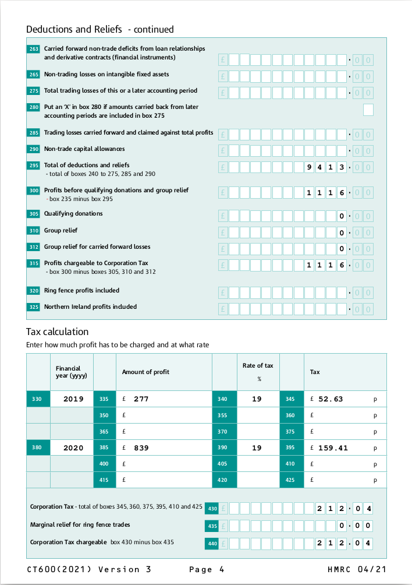

# `ixbrl-to-ct600`

## Overview

This project is retro technology.  It takes as input a file containing UK
corporation tax calculations in iXBRL form.  It then takes HMRC's CT600
form and annotates the computations into the form.

The output is a PDF file which could in theory be filed with HMRC, if HMRC
were still accepting CT600 forms, which they are mostly not.

It is designed to use the output of `gnucash-ixbrl` with the
`corporation-tax.yaml` configuration.  It may work with other sources of
iXBRL.  Or not.

## Things to know

- There is no warranty.
- This is likely incomplete - it does what I want, but you shouldn't be
  playing with this project unless you're prepared to do some work checking
  the values are right for you, and possibly adding extra annotations to the
  form which aren't covered.
- It doesn't know about all the CT600 fields.

## Testing

There is a set of computations here:

```
./ixbrl-to-ct600  -DN 'Sarah McAcre' -C 06
```

You should get an output file in output.pdf.



## Warranty

This code comes with no warranty whatsoever.  See the [LICENSE](LICENCE) file
for details.  Further, I am not an accountant.  It is possible that this code
could be useful to you in meeting regulatory reporting requirements for your
business.  It is also possible that the software could report misleading
information which could land you in a lot of trouble if used for regulatory
purposes.  Really, you should check with a qualified accountant.
